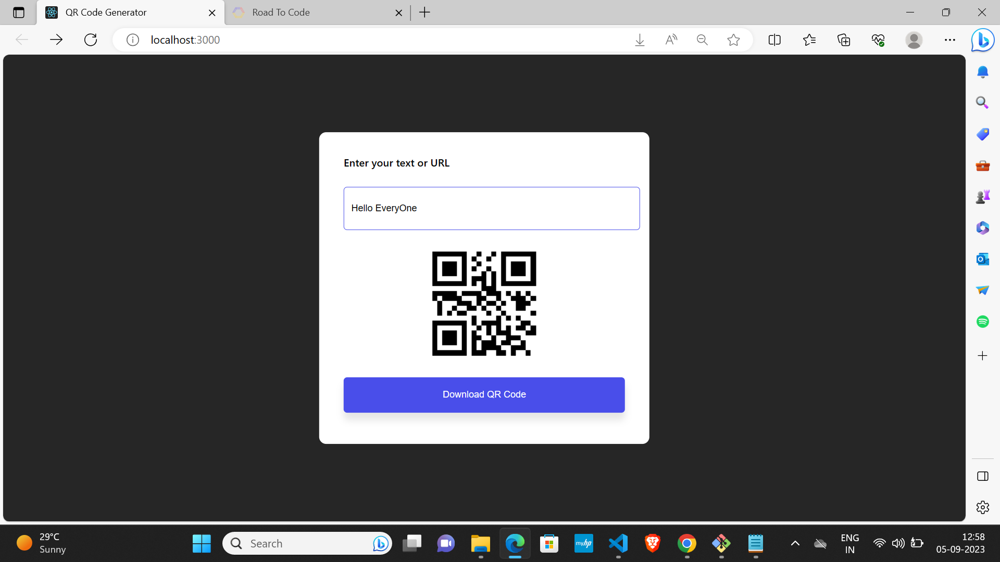

# QR Code Generator

This is a `QR Code Generator Project` using the API `https://api.qrserver.com/v1/create-qr-code`. You can generate a QR code for any text or URL and download it in a single click.
 
I used basic `React` concepts and `file-saver` npm package to download the QR Code image.